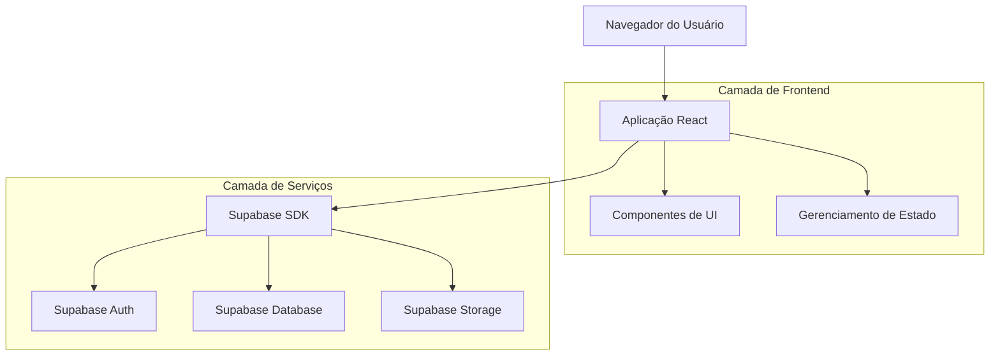
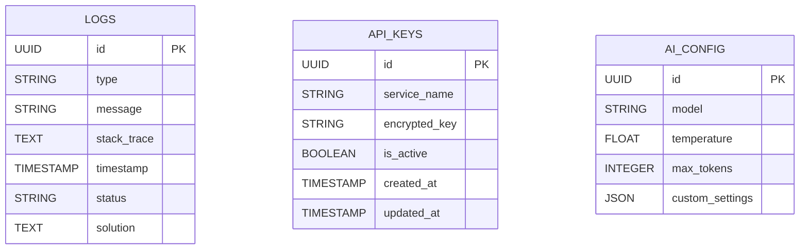

## 1. Arquitetura do Sistema



## 2. Tecnologias Utilizadas

- **Frontend**: React@18 + TypeScript + TailwindCSS@3
- **Ferramenta de Inicialização**: vite-init
- **Backend**: Supabase (BaaS)
- **Banco de Dados**: PostgreSQL (via Supabase)
- **Autenticação**: Supabase Auth
- **Gerenciamento de Estado**: Context API + useReducer

## 3. Definições de Rotas

| Rota | Propósito |
|------|-----------|
| /dashboard | Página principal com navegação para todas as funcionalidades |
| /logs | Visualização e gerenciamento de logs de erro |
| /api-keys | Gerenciamento unificado de chaves de API com navegação por abas |
| /ai-config | Configurações específicas do serviço de IA |
| /settings | Configurações gerais do sistema |

## 4. Definições de API

### 4.1 Correção de Logs
```
GET /api/logs/errors
```

Response:
```json
{
  "logs": [
    {
      "id": "uuid",
      "type": "database_error",
      "message": "Erro na query da tabela blacklisted_users",
      "stack_trace": "...",
      "timestamp": "2024-01-01T00:00:00Z",
      "status": "open"
    }
  ]
}
```

### 4.2 Gerenciamento de Chaves de API
```
POST /api/api-keys/validate
```

Request:
```json
{
  "service": "stripe",
  "api_key": "sk_test_..."
}
```

Response:
```json
{
  "valid": true,
  "message": "Chave válida"
}
```

## 5. Modelo de Dados

### 5.1 Estrutura do Banco de Dados



### 5.2 Definições DDL

**Tabela de Logs**
```sql
CREATE TABLE system_logs (
  id UUID PRIMARY KEY DEFAULT gen_random_uuid(),
  type VARCHAR(50) NOT NULL,
  message TEXT NOT NULL,
  stack_trace TEXT,
  timestamp TIMESTAMP WITH TIME ZONE DEFAULT NOW(),
  status VARCHAR(20) DEFAULT 'open',
  solution TEXT,
  created_at TIMESTAMP WITH TIME ZONE DEFAULT NOW()
);

CREATE INDEX idx_logs_type ON system_logs(type);
CREATE INDEX idx_logs_status ON system_logs(status);
CREATE INDEX idx_logs_timestamp ON system_logs(timestamp DESC);
```

**Tabela de Chaves de API**
```sql
CREATE TABLE api_keys (
  id UUID PRIMARY KEY DEFAULT gen_random_uuid(),
  service_name VARCHAR(100) UNIQUE NOT NULL,
  encrypted_key TEXT NOT NULL,
  is_active BOOLEAN DEFAULT true,
  created_at TIMESTAMP WITH TIME ZONE DEFAULT NOW(),
  updated_at TIMESTAMP WITH TIME ZONE DEFAULT NOW()
);

-- Permissões Supabase
GRANT SELECT ON api_keys TO anon;
GRANT ALL PRIVILEGES ON api_keys TO authenticated;
```

**Tabela de Configurações de IA**
```sql
CREATE TABLE ai_configurations (
  id UUID PRIMARY KEY DEFAULT gen_random_uuid(),
  model VARCHAR(100) NOT NULL,
  temperature FLOAT CHECK (temperature >= 0 AND temperature <= 2),
  max_tokens INTEGER CHECK (max_tokens > 0),
  custom_settings JSONB,
  created_at TIMESTAMP WITH TIME ZONE DEFAULT NOW(),
  updated_at TIMESTAMP WITH TIME ZONE DEFAULT NOW()
);
```

## 6. Componentes React Principais

### 6.1 Correção de Queries Supabase
```typescript
// hooks/useSupabaseFixes.ts
export const useSupabaseFixes = () => {
  const fixBlacklistedUsersQuery = async () => {
    // Implementar correção da query
  }
  
  const fixSupportClaimsQuery = async () => {
    // Implementar correção da query
  }
  
  const fixReferralsQuery = async () => {
    // Implementar correção da query
  }
  
  return { fixBlacklistedUsersQuery, fixSupportClaimsQuery, fixReferralsQuery }
}
```

### 6.2 Gerenciamento de Chaves com Abas
```typescript
// components/ApiKeyManager.tsx
interface TabConfig {
  id: string
  label: string
  service: string
}

const tabs: TabConfig[] = [
  { id: 'external', label: 'Serviços Externos', service: 'external' },
  { id: 'integrations', label: 'Integrações', service: 'integrations' }
]
```

## 7. Segurança e Permissões

- **Políticas Row Level Security (RLS)** ativadas em todas as tabelas
- **Criptografia** de chaves de API no banco de dados
- **Validação** de permissões por role (admin, user)
- **Rate limiting** nas APIs de gerenciamento de chaves
- **Auditoria** de todas as modificações em logs e configurações