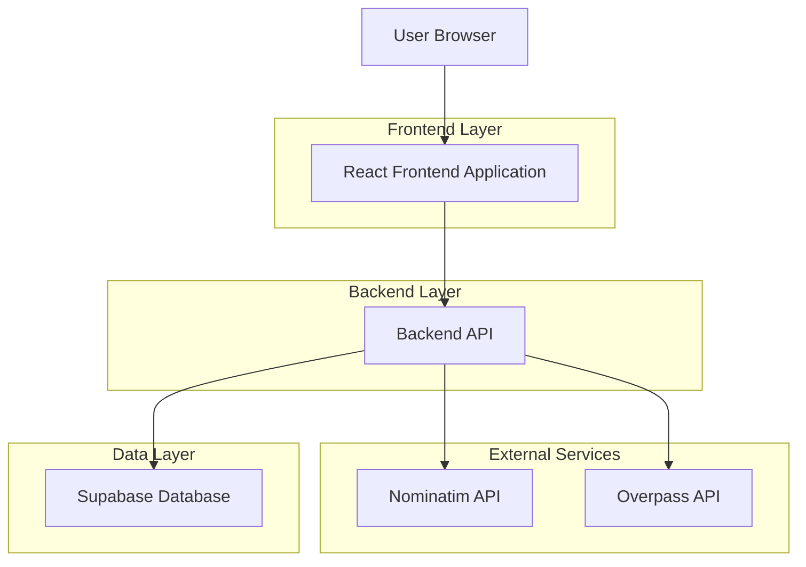
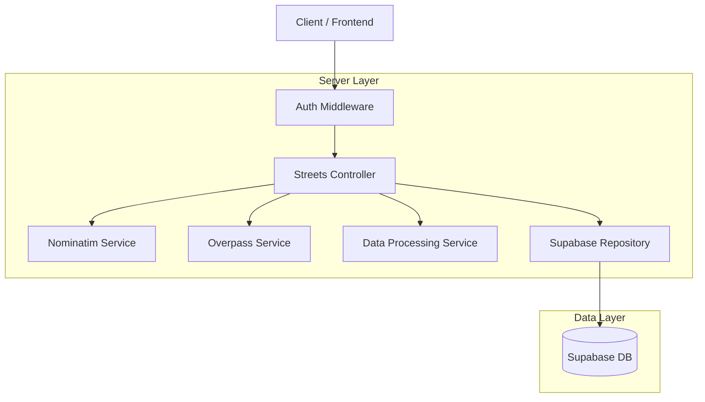
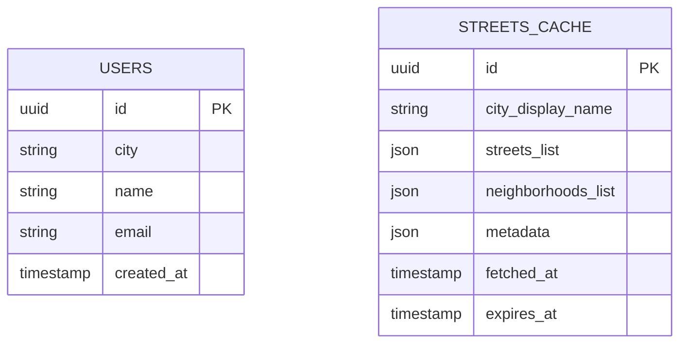

## 1. Architecture design



## 2. Technology Description
- Frontend: React@18 + tailwindcss@3 + vite
- Initialization Tool: vite-init
- Backend: Express@4 (Node.js)
- Database: Supabase (PostgreSQL)
- APIs Externas: Nominatim (OpenStreetMap), Overpass API

## 3. Route definitions
| Route | Purpose |
|-------|---------|
| /api/streets-neighborhoods | Buscar ruas e bairros da cidade do usuário |
| /api/user/city | Obter cidade cadastrada do perfil do usuário |
| /streets-neighborhoods | Página do módulo de ruas e bairros |

## 4. API definitions
### 4.1 Core API

**Buscar ruas e bairros**
```
GET /api/streets-neighborhoods
```

Request Headers:
| Param Name | Param Type | isRequired | Description |
|------------|------------|------------|-------------|
| Authorization | string | true | Bearer token do usuário autenticado |

Response:
| Param Name | Param Type | Description |
|------------|------------|-------------|
| cidade | string | Nome da cidade completo |
| bbox | object | Bounding box {south, west, north, east} |
| ruas | array | Lista de nomes de ruas |
| bairros | array | Lista de nomes de bairros |
| contagens | object | {ruas: number, bairros: number} |
| meta | object | Metadados das consultas |
| fetchedAt | string | Timestamp ISO da consulta |
| source | string | Fonte dos dados |
| error | string/null | Mensagem de erro se houver |

Example
```json
{
  "cidade": "Campinas, São Paulo, Brasil",
  "bbox": { "south": -22.9564, "west": -47.1629, "north": -22.7467, "east": -46.9678 },
  "ruas": ["Rua A", "Avenida B", "Rua C"],
  "bairros": ["Centro", "Vila Industrial", "Jardim do Lago"],
  "contagens": { "ruas": 1250, "bairros": 45 },
  "meta": {
    "nominatim": { "query": "Campinas, SP", "result_count": 1 },
    "overpass": { "query_summary": "highway with name + place tags", "elements_returned": 1295 }
  },
  "fetchedAt": "2025-12-08T15:04:05Z",
  "source": "OpenStreetMap (Nominatim + Overpass)",
  "error": null
}
```

## 5. Server architecture diagram



## 6. Data model (Atualizado)

### 6.1 Data model definition



### 6.2 Data Definition Language

**User Profiles (user_profiles)**
```sql
-- coluna de cidade utilizada pelo módulo
ALTER TABLE public.user_profiles ADD COLUMN IF NOT EXISTS city text;
```

**Streets Cache Table (streets_cache)**
```sql
-- create table
CREATE TABLE streets_cache (
    id UUID PRIMARY KEY DEFAULT gen_random_uuid(),
    city_display_name VARCHAR(500) UNIQUE NOT NULL,
    streets_list JSONB NOT NULL,
    neighborhoods_list JSONB NOT NULL,
    metadata JSONB NOT NULL,
    fetched_at TIMESTAMP WITH TIME ZONE DEFAULT NOW(),
    expires_at TIMESTAMP WITH TIME ZONE DEFAULT NOW() + INTERVAL '7 days'
);

-- create index
CREATE INDEX idx_streets_cache_city ON streets_cache(city_display_name);
CREATE INDEX idx_streets_cache_expires ON streets_cache(expires_at);

-- grant permissions
GRANT SELECT ON streets_cache TO anon;
GRANT ALL PRIVILEGES ON streets_cache TO authenticated;
```
