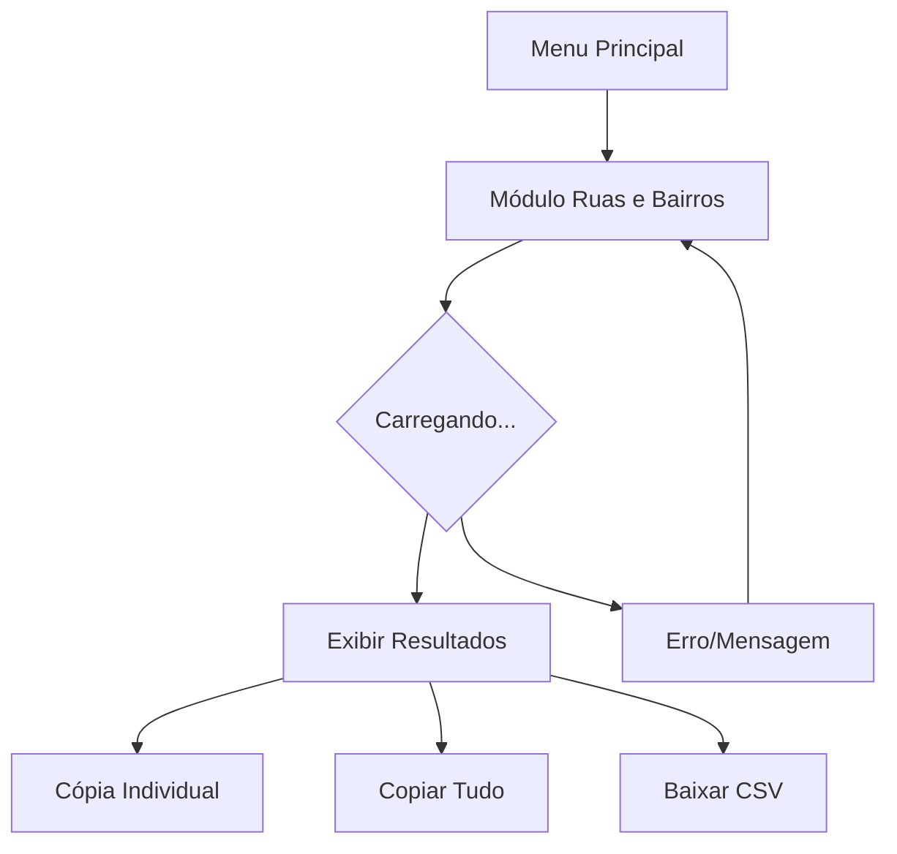

## 1. Product Overview
Módulo para listar ruas e bairros da cidade do usuário usando dados do OpenStreetMap. Resolve a necessidade de acesso rápido a informações geográficas locais para pesquisa, planejamento e referência.

## 2. Core Features

### 2.1 User Roles
| Role | Registration Method | Core Permissions |
|------|---------------------|------------------|
| All Users | Any registration method | Access module, view streets/neighborhoods, copy individual items, copy all, download CSV |

### 2.2 Feature Module
Nosso módulo de ruas e bairros consiste nos seguintes elementos principais:
1. **Página do Módulo**: exibição de ruas e bairros, botões de ação, informações da cidade.

### 2.3 Page Details
| Page Name | Module Name | Feature description |
|-----------|-------------|---------------------|
| Módulo Ruas e Bairros | Informações da Cidade | Exibir nome da cidade, bounding box e totais de ruas/bairros encontrados |
| Módulo Ruas e Bairros | Lista de Ruas | Exibir lista ordenada de ruas com botão individual de cópia para cada item |
| Módulo Ruas e Bairros | Lista de Bairros | Exibir lista ordenada de bairros |
| Módulo Ruas e Bairros | Ações Gerais | Botão "Copiar Tudo" para copiar lista completa e botão "Baixar CSV" para exportar dados |
| Módulo Ruas e Bairros | Tratamento de Erros | Exibir mensagens claras para cidade não encontrada, erro de API ou timeout |
| Módulo Ruas e Bairros | Loading State | Indicador de carregamento durante consultas às APIs |

## 3. Core Process
**Fluxo do Usuário:**
1. Usuário acessa o módulo pelo menu principal
2. Sistema identifica cidade do perfil do usuário
3. Consulta Nominatim para obter bounding box da cidade
4. Consulta Overpass API para buscar ruas e bairros
5. Processa dados: remove duplicatas, filtra nomes inválidos, ordena alfabeticamente
6. Exibe resultados com contagens totais
7. Usuário pode copiar nomes individuais, copiar tudo ou baixar CSV

## 4. User Interface Design
### 4.1 Design Style
- **Cores Primárias**: Azul (#2563eb) para headers e ações principais
- **Cores Secundárias**: Cinza claro (#f3f4f6) para backgrounds, Verde (#10b981) para sucesso
- **Botões**: Estilo arredondado com ícones de cópia e download
- **Fonte**: Inter ou sistema padrão, 14-16px para texto, 18-20px para headers
- **Layout**: Card-based com listas scrolláveis
- **Ícones**: Heroicons para copiar, download, e indicadores de loading

### 4.2 Page Design Overview
| Page Name | Module Name | UI Elements |
|-----------|-------------|-------------|
| Módulo Ruas e Bairros | Header | Título do módulo, nome da cidade em destaque, contador de itens em badge |
| Módulo Ruas e Bairros | Lista de Ruas | Cards expansíveis com nomes de ruas, botão copiar individual à direita, ícone de rua |
| Módulo Ruas e Bairros | Lista de Bairros | Cards similares com nomes de bairros, separador visual entre seções |
| Módulo Ruas e Bairros | Ações Gerais | Botões primários "Copiar Tudo" e "Baixar CSV" no topo da página |
| Módulo Ruas e Bairros | Estados | Skeleton loading durante carregamento, toast notifications para feedback de ações |

### 4.3 Responsiveness
- Desktop-first com adaptação mobile
- Layout responsivo: sidebar colapsa em telas pequenas
- Botões de cópia mantêm tamanho mínimo 44x44px para touch
- Listas empilham verticalmente em mobile