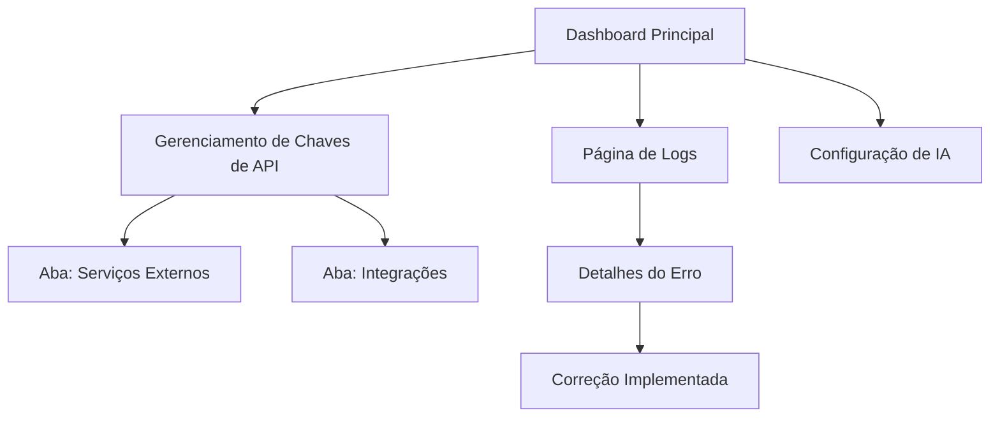

## 1. Visão Geral do Produto

Sistema de correção de erros e unificação de gerenciamento de chaves de API. O objetivo é resolver todos os erros apresentados nos logs e criar uma interface unificada e consistente para gerenciamento de configurações.

## 2. Funcionalidades Principais

### 2.1 Páginas e Módulos

O sistema consiste nas seguintes páginas principais:

1. **Página de Logs**: Visualização e análise de erros do sistema
2. **Gerenciamento de Chaves de API**: Interface unificada com navegação por abas
3. **Configuração de IA**: Página dedicada para configurações específicas do serviço de IA

### 2.2 Detalhamento das Páginas

| Página                  | Módulo                     | Descrição das Funcionalidades                                           |
| ----------------------- | -------------------------- | ----------------------------------------------------------------------- |
| Logs do Sistema         | Lista de Erros             | Exibir todos os 5 logs de erro identificados com detalhes e stack trace |
| Logs do Sistema         | Análise de Erros           | Permitir investigação detalhada de cada erro com sugestões de correção  |
| Logs do Sistema         | Status de Correção         | Marcar erros como corrigidos e acompanhar progresso                     |
| Gerenciamento de Chaves | Abas de Serviços           | Navegação por abas para diferentes serviços externos (exceto IA)        |
| Gerenciamento de Chaves | Formulário de Configuração | Adicionar, editar e remover chaves de API com validação                 |
| Gerenciamento de Chaves | Teste de Conexão           | Verificar validade das chaves configuradas                              |
| Configuração de IA      | Configurações Específicas  | Gerenciar apenas as configurações relacionadas ao serviço de IA         |

### 2.3 Correções de Erros Específicos

* **Erros de Queries Supabase**: Corrigir queries relacionadas às tabelas `blacklisted_users`, `support_claims` e `referrals`

* **Erros de Menu Duplicado**: Remover entrada duplicada do elemento `button` no menu

* **Erros de Navegação**: Implementar sistema de abas para unificar páginas relacionadas

## 3. Fluxo de Navegação

## 4. Interface do Usuário

### 4.1 Estilo de Design

* **Cores Primárias**: Azul (#2563EB) para elementos principais

* **Cores Secundárias**: Cinza (#6B7280) para textos secundários

* **Botões**: Estilo arredondado com hover effects

* **Fontes**: Inter para textos principais, tamanhos 14-16px

* **Layout**: Baseado em cards com sombras sutis

### 4.2 Elementos por Página

| Página                  | Módulo             | Elementos de UI                                              |
| ----------------------- | ------------------ | ------------------------------------------------------------ |
| Logs do Sistema         | Lista de Erros     | Tabela com colunas: Tipo, Mensagem, Data, Status, Ações      |
| Logs do Sistema         | Detalhes do Erro   | Modal com stack trace completo e sugestões de correção       |
| Gerenciamento de Chaves | Abas de Navegação  | Abas horizontais com indicadores de status por serviço       |
| Gerenciamento de Chaves | Formulário         | Inputs com máscara para chaves, botões de teste e salvar     |
| Configuração de IA      | Interface Dedicada | Formulários específicos para modelo, temperatura, max tokens |

### 4.3 Responsividade

* Design desktop-first com adaptação para mobile

* Breakpoints: 768px e 1024px

* Touch otimizado para dispositivos móveis

## 5. Critérios de Sucesso

* ✅ Todos os 5 erros de logs resolvidos e validados

* ✅ Sistema de gerenciamento de chaves unificado com navegação por abas

* ✅ Remoção completa de redundâncias na interface

* ✅ Página de configuração de IA mantida separada conforme requisito

* ✅ Interface consistente e intuitiva para o usuário final

